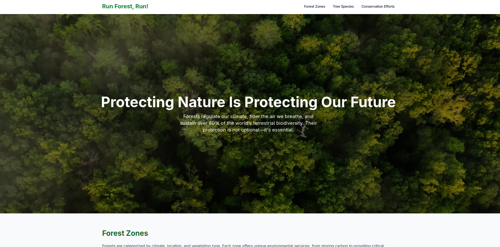

# 🌲 Forestal JSP

A web-based system developed using Java EE and Clean Architecture to manage forest zones, tree species, and conservation activities. The application includes geospatial features, interactive maps, and modern UI components for effective environmental data management.

## 📦 Project Structure

This system is built using the principles of **Clean Architecture**, separating concerns into different layers:

- `domain.model`: Core domain entities (e.g., ForestZone, TreeSpecies).
- `domain.repository`: Interfaces for use-case-level operations.
- `infrastructure.persistence`: DAO implementations for PostgreSQL.
- `infrastructure.config`: Configuration and DB connection.
- `presentation.controller`: Servlets acting as controllers.
- `web pages`: JSP-based front-end views for user interaction.

## 🛠️ Technologies Used

### 🔙 Backend
- Java EE 10
- JSP (JavaServer Pages)
- Servlet API
- Clean Architecture
- DAO Pattern

### 🗃️ Database
- PostgreSQL (via Docker container)
- UUID & JSONB for flexible and safe data storage

### 🎨 Frontend
- HTML5 & Vanilla JavaScript
- [Tailwind CSS](https://tailwindcss.com/) – Utility-first CSS framework
- [Leaflet.js](https://leafletjs.com/) + Leaflet Draw – Interactive map with polygon drawing
- [Simple DataTables](https://github.com/fiduswriter/Simple-DataTables) – Lightweight datatable library

### ⚙️ Tools
- Docker (for PostgreSQL deployment)
- NetBeans or compatible IDE
- JDBC

## 🚀 Features

- Register and update forest zones with geospatial boundaries
- Manage tree species and their relationships to forest zones
- Record conservation activities
- Draw and edit polygons on interactive maps
- Dynamic and searchable data tables
- Modular architecture for easy maintenance and scaling

## 📷 Screenshots



## 📦 Getting Started

### Prerequisites
- Java 17+
- Apache Tomcat 10+
- Docker and Docker Compose (for database)
- PostgreSQL JDBC driver

### Run PostgreSQL via Docker

```bash
docker run --name forestal-db -e POSTGRES_USER=forestal_tree \
-e POSTGRES_PASSWORD=admin123 -e POSTGRES_DB=forestal \
-p 5432:5432 -d postgres
